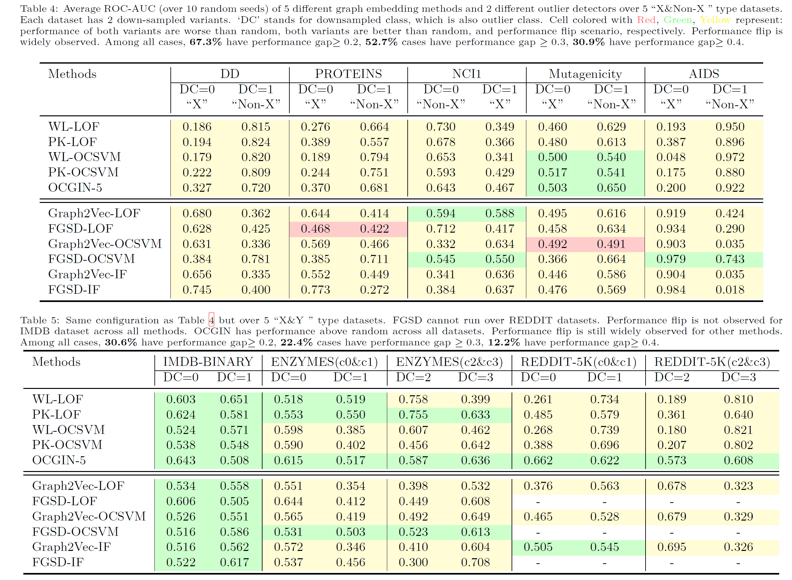

# GLOD-Issues
Source code  and additional results for [On Using Classification Datasets to Evaluate Graph Outlier
Detection](https://arxiv.org/pdf/2012.12931.pdf). 


# Full Results


# Run Models
Kernels (WL, PK)
```python
from loader import *
from kernel import *
data_name = 'DD'
dataset = load_data(data_name)[2] 
loader = DataLoader(dataset, batch_size=1, shuffle=False)
model = KernelBasedGLAD(kernel='WL', detector='LOF', WL_iter=5, PK_bin_width=0.1)
model.fit(loader) 
```
Embeddings (Graph2Vec, FGSD)
```python
from loader import *
from embedder import *
data_name = 'DD'
dataset = load_data(data_name)[2] 
loader = DataLoader(dataset, batch_size=1, shuffle=False)
model = EmbeddingBasedGLAD(embedder='FGSD', detector='LOF', G2V_wl_iter=3, normalize_embedding=False)
model.fit(loader)
```
OCGIN
```python
from loader import *
from ocgin import *
data_name = 'DD'
loaders = create_loaders(data_name, batch_size=32)
model = OCGIN(loaders[3][0].num_features, weight_decay=5e-4, nlayer=5)
trainer = pl.Trainer(gpus=1, max_epochs=25, logger=False,  weights_summary=None)
trainer.fit(loaders[0])
trainer.test(test_dataloaders=loaders[2])[0]
```


# Cite
Please cite our paper if you use the code. 

```
@article{zhao2021glod-issues,
  title={On using classification datasets to evaluate graph outlier detection: Peculiar observations and new insights},
  author={Zhao, Lingxiao and Akoglu, Leman},
  journal={Big Data},
  year={2021},
  publisher={Mary Ann Liebert, Inc., publishers 140 Huguenot Street, 3rd Floor New~…}
}
```
